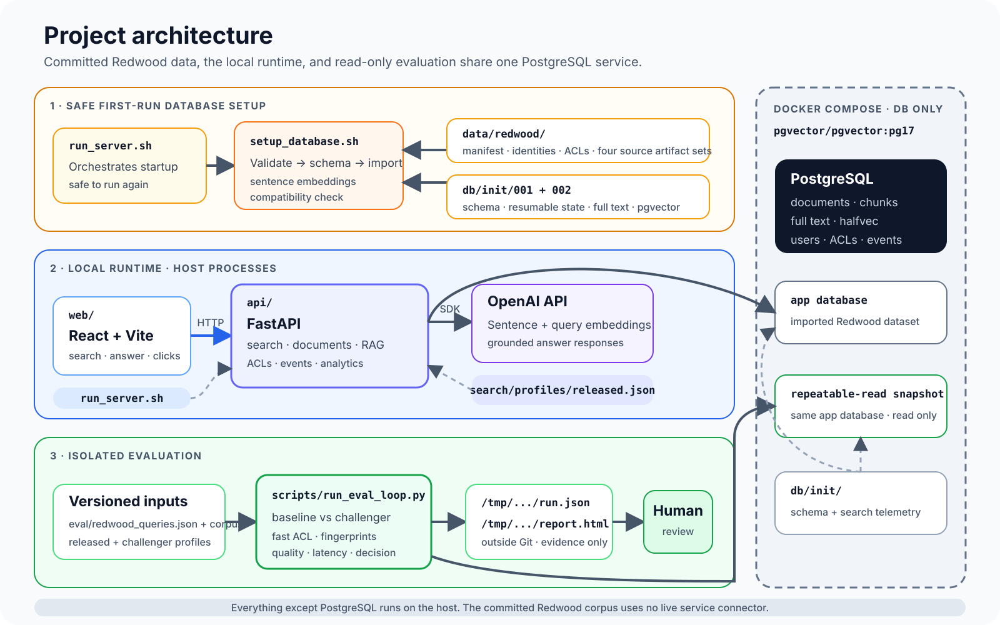
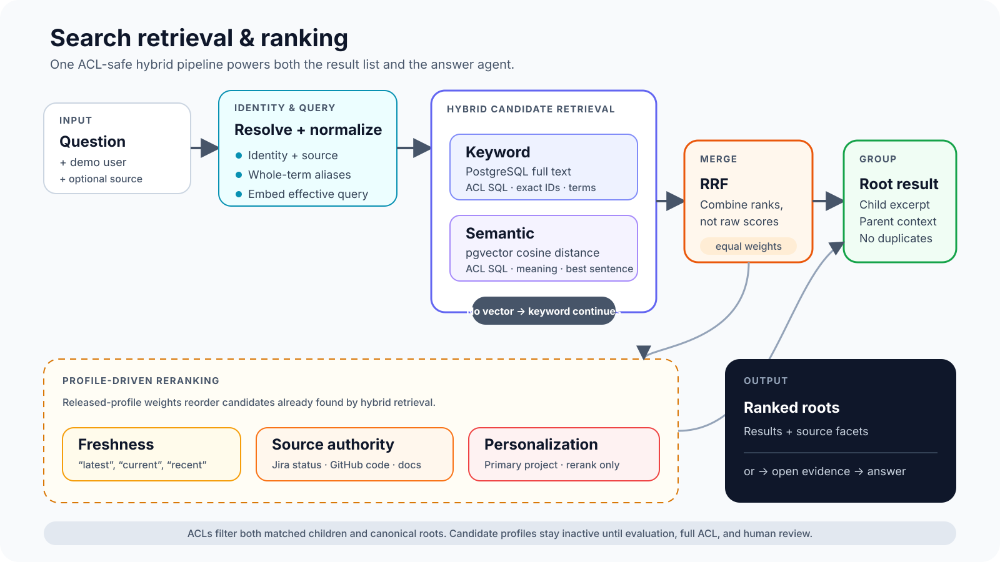
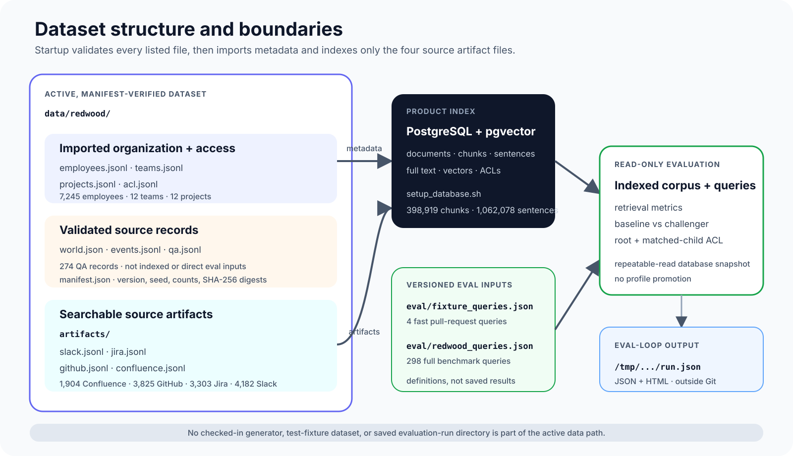
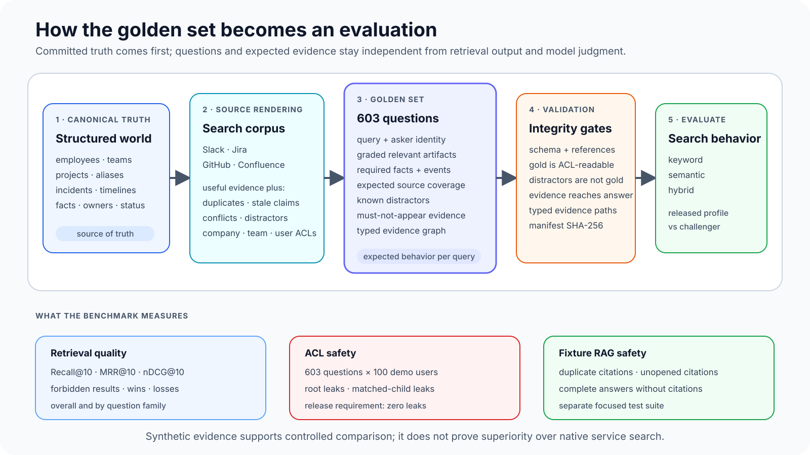
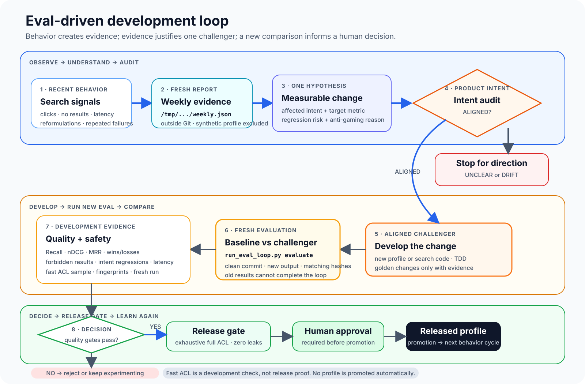

# Knowledge Browser

Knowledge Browser is a local company-knowledge search product for Slack, Jira,
Confluence, and GitHub content. It combines ACL-safe hybrid retrieval with
grounded AI answers and source-aware document views.

The repository includes the API, web app, PostgreSQL development service,
company dataset, released search profile, evaluation queries, and release
safety checks. Demo identity is used only to exercise document permissions; it
is not production authentication.

## Requirements

- Python 3.12
- Node.js 22.22.2 or newer
- Docker with Compose
- An OpenAI API key for first-run embeddings and grounded answers

## Install

Create the Python environment and install the web dependencies:

```bash
cd /path/to/knowledge-browser
python3.12 -m venv api/.venv
api/.venv/bin/python -m pip install -e './api[dev]'
(cd web && npm ci)
```

Create the local environment file and add your OpenAI API key:

```bash
cp .env.example .env
```

```dotenv
OPENAI_API_KEY=your-key-here
```

Do not commit `.env`.

## Run

From any directory, run:

```bash
/path/to/knowledge-browser/run_server.sh
```

On the first run, the script:

1. starts PostgreSQL with Docker Compose;
2. waits for the database to become ready;
3. creates the Knowledge Browser schema;
4. validates and imports the committed `data/company/` dataset;
5. creates embeddings and checks database compatibility;
6. starts the FastAPI and React/Vite development servers.

The first import creates 100 users, 1,000 documents, 13,145 chunks, and 16,520
sentences. Later runs verify and reuse that database instead of importing it
again.

Open:

- Web: <http://127.0.0.1:5173>
- API health: <http://127.0.0.1:8000/api/health>

Press `Ctrl+C` to stop the API and web servers. PostgreSQL continues running
until you run `docker compose down`.

### Database safety

First-run setup never resets or replaces data. It stops when it finds a
partially initialized or incompatible database. A compatible populated
database is reused without another import.

`DATABASE_URL` takes precedence when set. Otherwise the application uses the
`POSTGRES_HOST`, `POSTGRES_PORT`, `POSTGRES_DB`, `POSTGRES_USER`, and
`POSTGRES_PASSWORD` values in `.env`. Already exported environment variables
override `.env`. When an explicit `DATABASE_URL` is supplied, startup does not
launch the project Docker database.

`API_PORT` and `WEB_PORT` change the local server ports. `ANSWER_MODEL` selects
the grounded-answer model. If a query embedding fails after setup, keyword
search remains available.

### Full Redwood database

The ignored local `data/redwood/` dataset can be imported into a separate
PostgreSQL database. This workflow never changes the normal
`knowledge_search` database, and normal `docker compose up` does not start the
Redwood service.

```bash
./scripts/redwood_database.sh start
./scripts/redwood_database.sh validate --data /path/to/redwood
./scripts/redwood_database.sh reset --data /path/to/redwood --yes
./scripts/redwood_database.sh run --data /path/to/redwood
./scripts/redwood_database.sh status
./scripts/redwood_database.sh verify --data /path/to/redwood --json
./scripts/redwood_database.sh stop
```

`reset` first validates the complete dataset and then requires `--yes`. It
refuses every database name except `knowledge_redwood`. The import saves each
completed batch, so running `run` again continues from the last saved line.
Only uncached sentences need the configured OpenAI API key.

If a manually created container already uses the name
`knowledge-redwood-db`, `start` stops safely. Remove that exact container only
after confirming it is the old Redwood pilot, then run `start` again.

## Product behavior

Choose a user from the Demo user menu, then search across Slack, Jira,
Confluence, and GitHub. The selected identity controls which documents the API
may retrieve, open, and cite.

Search supports:

- keyword and semantic retrieval;
- exact Jira keys;
- reciprocal-rank fusion and one result per root document;
- freshness, source-authority, and primary-project reranking;
- source facets and local source-detail panels;
- grounded answers with ACL-safe citations.

Search snippets are leads rather than citable evidence. The answer workflow
must open a chunk before citing it, and the server validates permissions,
budgets, evidence state, and citations throughout the request.

## Project architecture

Knowledge Browser runs the web app and API directly on the host. Docker Compose
runs PostgreSQL with pgvector. The first startup validates and imports the
committed company dataset; later startups verify and reuse the populated
database without resetting it.



| Area | Primary paths | Responsibility |
| --- | --- | --- |
| Local runtime | `run_server.sh`, `web/`, `api/` | Start React/Vite and FastAPI, serve search, documents, answers, and event capture |
| Data and index | `data/company/`, `db/init/`, `scripts/setup_database.sh` | Validate the manifest, create the schema, import artifacts and ACLs, and build sentence embeddings |
| Search configuration | `search/profiles/` | Keep released and challenger retrieval settings versioned and reviewable |
| Evaluation | `eval/`, `scripts/run_eval_loop.py` | Compare profiles on controlled queries and write review artifacts outside Git |

The API package lives in `api/src/knowledge_browser/`. PostgreSQL stores users,
groups, permissions, root and child documents, full-text chunks, sentence
vectors, and search events. OpenAI provides first-run sentence embeddings,
query embeddings, and grounded answer generation; keyword retrieval remains
available if a query embedding fails after setup.

The main API routes are:

- `GET /api/health`
- `GET /api/demo-users`
- `GET /api/search`
- `POST /api/answer`
- `GET /api/documents/{source}/{external_id}`
- `POST /api/search-events/{search_id}/click`

## Search architecture

One profile-controlled hybrid pipeline powers the result list and the initial
evidence search for grounded answers. Permission checks happen in SQL before a
document can become a candidate, not after ranking.



1. The API resolves the selected demo identity, validates the optional source,
   and normalizes the query with the active profile. Profiles can apply
   whole-term project aliases without rewriting Jira issue keys or larger
   words.
2. Keyword and semantic retrieval run independently. PostgreSQL full-text
   search favors exact identifiers and term overlap; pgvector finds the nearest
   indexed sentence by meaning. Both paths require access to the matched child
   and its canonical root.
3. Reciprocal rank fusion combines rank positions rather than incompatible raw
   scores. Profile-weighted exact Jira-key, freshness, source-authority, and
   primary-project signals can reorder candidates already found by retrieval.
4. Matches are grouped by canonical root, keeping the highest-ranked matching
   child excerpt while returning each root only once.
5. Search returns ranked snippets and source facets. The answer workflow treats
   snippets as leads, opens full allowed chunks, and accepts citations only from
   evidence opened during that request.

The runtime default is `search/profiles/released.json`. Files under
`search/profiles/candidates/` do not change product behavior by themselves;
promotion requires fresh quality evidence, exhaustive ACL verification, and
human approval.

## Dataset structure

Knowledge Browser ships one committed dataset under `data/company/`. Startup
validates its complete manifest, builds identity and access metadata from the
organization records, and indexes the Slack, Jira, GitHub, and Confluence
renderings under `data/company/artifacts/`.



- `employees.jsonl`, `teams.jsonl`, `projects.jsonl`, and `acl.jsonl` produce
  user, group, project-alias, and access metadata during import.
- `world.json`, `events.jsonl`, `qa.jsonl`, and `evidence_graphs.jsonl` are
  manifest-verified organization, truth, and expected-evidence source records.
  They do not become searchable documents or direct evaluation inputs.
- `manifest.json` records the dataset version, seed, counts, and SHA-256 digest
  of every listed dataset file.
- `eval/golden_queries.json` and `eval/queries.json` are versioned evaluation
  inputs, not alternate datasets or saved run output.

The repository does not contain a dataset generator or a saved evaluation-run
directory. The eval-driven loop writes each run to a new output directory
outside Git, such as `/tmp/knowledge-browser-runs/<id>`.

## Golden set and evaluation

The committed benchmark begins with structured company truth and renders it
across Slack, Jira, GitHub, and Confluence alongside duplicates, stale claims,
conflicts, distractors, and access restrictions. Expected evidence is defined
independently from search output.



The dataset contains 100 employees in 10 teams, 25 projects, 125 incidents, and
1,000 artifacts—250 from each source. `data/company/manifest.json` fingerprints
every listed dataset file. The evaluation definitions are separated by runtime
cost:

| File | Purpose |
| --- | --- |
| `eval/golden_queries.json` | Four small, hand-checkable queries for fast pull-request evaluation |
| `eval/queries.json` | The complete 603-question retrieval benchmark |

| Question family | Questions | What it evaluates |
| --- | ---: | --- |
| **Lexical / known item** | 125 | Exact IDs, names, and keywords |
| **Semantic** | 151 | The same meaning expressed with different wording |
| **Multi-hop** | 125 | Evidence combined across documents and sources |
| **Temporal** | 150 | Current truth, ordering, and conflicting old claims |
| **Alias** | 25 | Project acronyms and different cross-source names |
| **Personalized** | 25 | Relevance to the asker's primary project |
| **Negative / not found** | 2 | Returning no supported evidence without inventing or leaking an answer |
| **Total** | **603** | |

Retrieval reports MRR@10 for the first relevant result, nDCG@10 for graded
ordering, Recall@10 for expected-evidence coverage, and forbidden-result leaks.
Released-versus-challenger comparisons also record per-query wins, losses, and
ties plus latency.

Fast pull-request checks use four golden queries and a deterministic ACL sample.
The `full_retrieval` gate runs all 603 questions against the populated database.
The `full_acl` gate evaluates 603 questions across 100 users—60,300 pairs—and
requires zero canonical-root and matched-child leaks. Full retrieval and full
ACL are manual or nightly release gates, not ordinary pull-request checks.

These controlled results compare Knowledge Browser profiles on committed
synthetic data. They do not by themselves prove superiority over native Slack,
Jira, GitHub, or Confluence search.

## Eval-driven development loop

Search changes begin with fresh behavior evidence, not a speculative ranking
tweak. One observed problem becomes one intent-audited hypothesis, one new
challenger, and one new comparison.



```text
Behavior → Insight → Hypothesis → Intent audit → Challenger → New eval → Decision
```

Generate a fresh read-only behavior report outside every Git worktree:

```bash
PYTHONPATH=api/src api/.venv/bin/python scripts/run_eval_loop.py analyze \
  --days 7 \
  --output-dir /tmp/knowledge-browser-behavior
```

After the contract, tests, challenger, and experiment manifest are committed in
a clean worktree, run a fresh comparison:

```bash
PYTHONPATH=api/src api/.venv/bin/python scripts/run_eval_loop.py evaluate \
  --experiment eval/experiments/<id>/experiment.json \
  --output-dir /tmp/knowledge-browser-runs/<id>
```

The runner rejects stale or empty evidence, an unchanged challenger, a
non-`ALIGNED` intent audit, incomplete embeddings, a dirty worktree, mismatched
input hashes, or an output directory that already exists. Baseline, challenger,
and fast ACL checks share one read-only repeatable-read database snapshot.

A passing development comparison can only recommend the separate release gate.
The exhaustive full ACL check and human approval are still required before a
profile is promoted. No evaluation command edits
`search/profiles/released.json` automatically.

## Verification

```bash
# Normal API checks; expensive release gates stay excluded
api/.venv/bin/python -m pytest -q \
  -m "not (full_acl or full_retrieval or nightly)" api/tests

# Web checks
(cd web && npm test -- --run)
(cd web && npm run build)

# Startup shell checks
scripts/test_setup_database.sh
scripts/test_run_server.sh

# Configuration and formatting checks
docker compose config --quiet
git diff --check
```

The exhaustive `full_retrieval` and `full_acl` groups are separate manual or
nightly release gates.

## Project rules

- Product intent: `docs/PRODUCT_INTENT.md`
- Feature contract template: `docs/contracts/FEATURE_CONTRACT_TEMPLATE.md`
- Repository workflow: `AGENTS.md`
